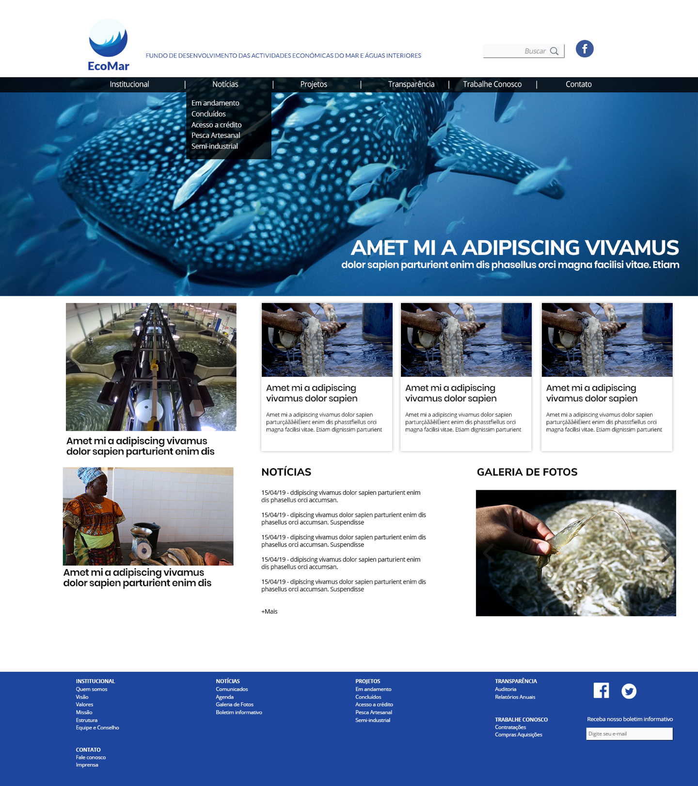

# EcoMac (2019)

Front-end and back-end development of EcoMar - Fundo de Desenvolvimento das Actividades Económicas do Mar e Águas Interiores

### Front-end Development
- HTML5
- CSS3
- JavaScript
- Bootstrap
- jQuery

### Back-end Development
- WordPress

# Screenshot

# References
- Created using <a href="https://github.com/marceloglacial/snowfall-boilerplate">Snowfall Boilerplate</a> 
