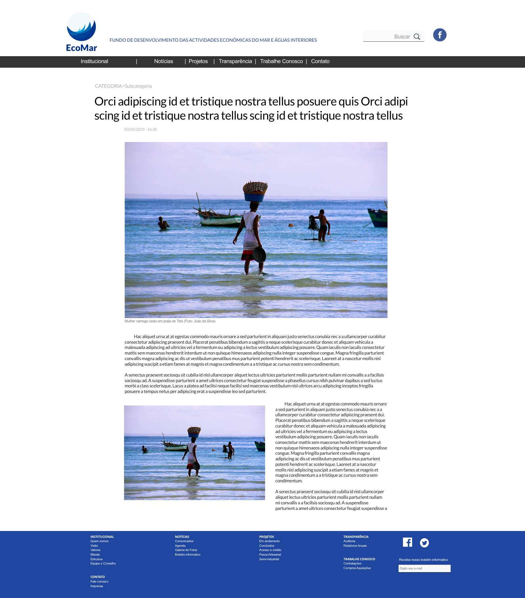
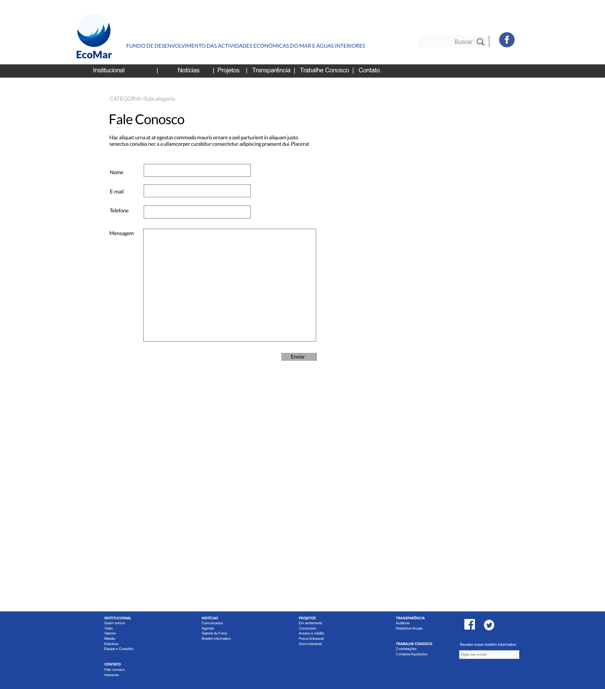

# ProAzul (2019)
Front-end and Back-end Development of ProAzul - Fundo de Desenvolvimento das Actividades Económicas do Mar e Águas Interiores.

## Front-end Development
- HTML5 starter template files
- <a href="https://github.com/thedaviddias/Front-End-Checklist">Front-end checklist</a> ready
- <a href="https://sass-lang.com/">SASS</a> ready
- <a href="https://sass-guidelin.es/#architecture">SASS Architecture</a> ready
- <a href="https://handlebarsjs.com/">Handlebars</a> templates
- Minified HTML (optional)
- Minifiend JS
- Optmized Images


### Live Demo: 
https://marceloglacial.github.io/2019-proazul/front-end/dist/

## Back-end Development
- <a href="https://docs.docker.com/compose/wordpress/">WordPress Docker Compose</a> ready

## CI/CD
- <a href="#deploy">FTP Deploy</a> integrated
- <a href="#deploy">Travis CI</a> ready

## Installation

1. <a href="https://docs.docker.com/compose/install/">Install Docker Compose</a>
2. [Install npm](https://www.npmjs.com/get-npm)
3. [Install Gulp](https://gulpjs.com)
4. Run installation on terminal: 

```terminal
    npm install 
```

# How to Use

- `npm run frontend` - Start front-end developement
- `npm run backend` - Start back-end developement

# Design 


---



---



# References
- Created using <a href="https://github.com/marceloglacial/snowfall-boilerplate">Snowfall Boilerplate</a> 
